<!DOCTYPE html>
<html>
<head>
	<title></title>
	  <meta charset="UTF8">
  <meta name="viewport" content="width=devices-width,initial-scale=1.0">
  <meta http-equip="X-UA-Compaitable" content="ie=edge">
<link rel="stylesheet" type="text/css" href="https://stackpath.bootstrapcdn.com/bootstrap/4.4.1/css/bootstrap.min.css" integrity="sha384-Vkoo8x4CGsO3+Hhxv8T/Q5PaXtkKtu6ug5TOeNV6gBiFeWPGFN9MuhOf23Q9Ifjh" crossorigin="anonymous">
<link rel="stylesheet" type="text/css" href="https://stackpath.bootstrapcdn.com/font-awesome/4.7.0/css/font-awesome.min.css">

<link rel="stylesheet" type="text/css" href="ptv.css">

</head>
<body>
	

 <nav class="navbar navbar-expand-lg navbar-light bg-light fixed-top" style="background-color: #192332 !important; border-top: 10px solid #54c4c1;">
  <a class="navbar-brand" href="#"><b style="color: #fff; font-family: cursive; font-size: unset;">GWALIOR TOURISM</b></a>
  <button class="navbar-toggler" type="button" data-toggle="collapse" data-target="#navbarSupportedContent" aria-controls="navbarSupportedContent" aria-expanded="false" aria-label="Toggle navigation">
    
  </button>

  

    <ul class="navbar-nav mr-auto">
      <li class="nav-item active">
        <a class="nav-link" href="GwlTourism.html"><b style="border: 2px solid dodgerblue; padding: 7px;">Home</b>(current)</a>
      </li>
      <li class="nav-item dropdown">
        <a class="nav-link dropdown-toggle" href="ptv.html" id="navbarDropdown" role="button" data-toggle="dropdown" aria-haspopup="true" aria-expanded="false"><b>
          Places To Visit</b>
        </a>
        

          <a class="dropdown-item" href="ptv.html">Gwalior Fort</a>
          <a class="dropdown-item" href="ptv.html">Jai-Vilas palace</a>
          <a class="dropdown-item" href="ptv.html">Gujari Mahal [State Archaeological Museum]</a>
          <a class="dropdown-item" href="ptv.html">Man Mandir palace</a>
          <a class="dropdown-item" href="ptv.html">Tomb of Tansen</a>
          <a class="dropdown-item" href="ptv.html">Teli Ka Mandir</a>
          

          <a class="dropdown-item" href="ptv.html">And Many More....</a>
        

      </li>
      <li class="nav-item">
        <a class="nav-link" href="hotel.html"><b>Hotels</b></a>
      </li>
      <li class="nav-item">
        <a class="nav-link" href="food.html"><b>Restaurant</b></a>
      </li>
      <li class="nav-item">
        <a class="nav-link" href="#"><b>How To Reach</b></a>
      </li>
      <li class="nav-item">
        <a class="nav-link" href="contact.html"><b>Contact Us</b></a>
      </li>
    </ul>
  
 
  

 
 

  <ol class="carousel-indicators">
    <li data-target="#carouselExampleCaptions" data-slide-to="0" class="active"></li>
     <li data-target="#carouselExampleCaptions" data-slide-to="1"></li>
    <li data-target="#carouselExampleCaptions" data-slide-to="2"></li>
    <li data-target="#carouselExampleCaptions" data-slide-to="3"></li>
  <li data-target="#carouselExampleCaptions" data-slide-to="4"></li>
    </ol>
  

    

      
      

        <h2>Gwalior Resturants</h2>
      

    

    

      
      

        <h2><b>Indian Food</b></h2>
    

    

    

      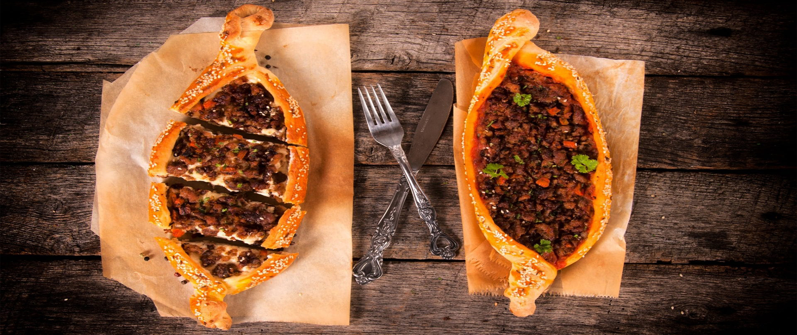
      

        <h2><b>Italian Food</b></h2>
      

    

    

      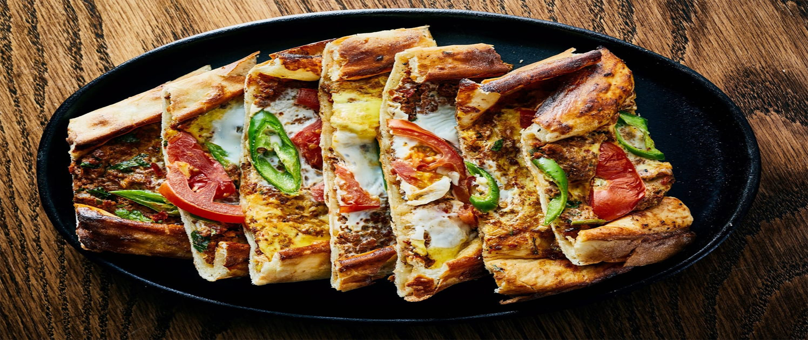
      

        <h2><b>American Dishe</b></h2>
      

    

    

      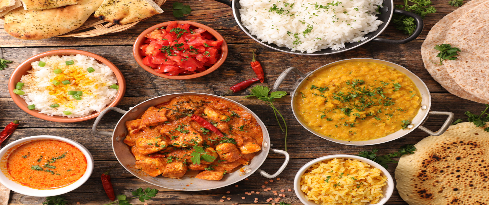
      

        <h2><b>Indian Thali</b></h2>
      

    

  

  <a class="carousel-control-prev" href="#carouselExampleCaptions" role="button" data-slide="prev">
    
    Previous
  </a>
  <a class="carousel-control-next" href="#carouselExampleCaptions" role="button" data-slide="next">
    
    Next
  </a>

  

  <h1 style="text-align: center;"><b><u>Resturants in Gwalior</u></b></h1>
   

  
  <aside style=" width: 29%; margin-left: 1%;">
          <form>
  
  <label><h5><b>Location :</b></h5></label>
             
            <input type="text" name="Location" class="form-control" placeholder="Enter Region">
              
            

       <label><h5><b>Establishment Type </b></h5></label>
        
       

  <input type="radio" id="customRadio1" name="customRadio" class="custom-control-input">
  <label class="custom-control-label" for="customRadio1">Resturants</label>

  <input type="radio" id="customRadio2" name="customRadio" class="custom-control-input">
  <label class="custom-control-label" for="customRadio2">Dessert</label>

  <input type="radio" id="customRadio3" name="customRadio" class="custom-control-input">
  <label class="custom-control-label" for="customRadio3">Coffee & Tea</label>

  <input type="radio" id="customRadio4" name="customRadio" class="custom-control-input">
  <label class="custom-control-label" for="customRadio4">Quick Bites</label>

  <input type="radio" id="customRadio5" name="customRadio" class="custom-control-input">
  <label class="custom-control-label" for="customRadio5">Bakeries</label>

<label><h5><b>Resturants Features </b></h5></label>
        
       

  <input type="radio" id="customRadio6" name="customRadio" class="custom-control-input">
  <label class="custom-control-label" for="customRadio6">Delivery</label>

  <input type="radio" id="customRadio7" name="customRadio" class="custom-control-input">
  <label class="custom-control-label" for="customRadio7">Takeout</label>

  <input type="radio" id="customRadio8" name="customRadio" class="custom-control-input">
  <label class="custom-control-label" for="customRadio8">Table Service</label>

  <input type="radio" id="customRadio9" name="customRadio" class="custom-control-input">
  <label class="custom-control-label" for="customRadio9">Parking Available</label>

<label><h5><b>Meals </b></h5></label>
        
       

  <input type="radio" id="customRadio10" name="customRadio" class="custom-control-input">
  <label class="custom-control-label" for="customRadio10">Breakfast</label>

  <input type="radio" id="customRadio11" name="customRadio" class="custom-control-input">
  <label class="custom-control-label" for="customRadio11">Brunch</label>

  <input type="radio" id="customRadio12" name="customRadio" class="custom-control-input">
  <label class="custom-control-label" for="customRadio12">Lunch</label>

  <input type="radio" id="customRadio13" name="customRadio" class="custom-control-input">
  <label class="custom-control-label" for="customRadio13">Dinner</label>

<label><h5><b>Dishes </b></h5></label>
        
       

  <input type="radio" id="customRadioa" name="customRadio" class="custom-control-input">
  <label class="custom-control-label" for="customRadioa">Burger</label>

  <input type="radio" id="customRadiob" name="customRadio" class="custom-control-input">
  <label class="custom-control-label" for="customRadiob">Cakes</label>

  <input type="radio" id="customRadioc" name="customRadio" class="custom-control-input">
  <label class="custom-control-label" for="customRadioc">Fish</label>

  <input type="radio" id="customRadiod" name="customRadio" class="custom-control-input">
  <label class="custom-control-label" for="customRadiod">Ice Cream</label>

  <input type="radio" id="customRadioe" name="customRadio" class="custom-control-input">
  <label class="custom-control-label" for="customRadioe">Ice Cream</label>

  <input type="radio" id="customRadiof" name="customRadio" class="custom-control-input">
  <label class="custom-control-label" for="customRadiof">Lamb</label>

  <input type="radio" id="customRadiog" name="customRadio" class="custom-control-input">
  <label class="custom-control-label" for="customRadiog">Kabobs</label>

  <input type="radio" id="customRadioh" name="customRadio" class="custom-control-input">
  <label class="custom-control-label" for="customRadioh">Salad</label>

<a href="" style="color: black; text-align: center;"><b><u>Show More</u></b></a>

<label><h5><b>Dietary Restrictions </b></h5></label>
        
       

  <input type="radio" id="customRadioq" name="customRadio" class="custom-control-input">
  <label class="custom-control-label" for="customRadioq">Vegetarian Friendly</label>

  <input type="radio" id="customRadiow" name="customRadio" class="custom-control-input">
  <label class="custom-control-label" for="customRadiow">Vegan Options</label>

  <input type="radio" id="customRadioe" name="customRadio" class="custom-control-input">
  <label class="custom-control-label" for="customRadioe">Gluten Free Options</label>

  <input type="radio" id="customRadio2" name="customRadio" class="custom-control-input">
  <label class="custom-control-label" for="customRadio2">Ice Cream</label>

  <input type="radio" id="customRadior" name="customRadio" class="custom-control-input">
  <label class="custom-control-label" for="customRadior">Ice Cream</label>

<a href="" style="color: black; text-align: center;"><b><u>Show More</u></b></a>

</form>
            

    </aside>
  

    

      

        

    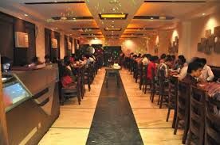
    

        <h4 class="card-title"><u>Volga Restaurant</u></h4>
        
 Rating: 3.9 
OPPOSITE RAJEEV PLAZA ,NEAR PARASMANI MALL, Jayendraganj, Lashkar, Gwalior, Madhya Pradesh. 
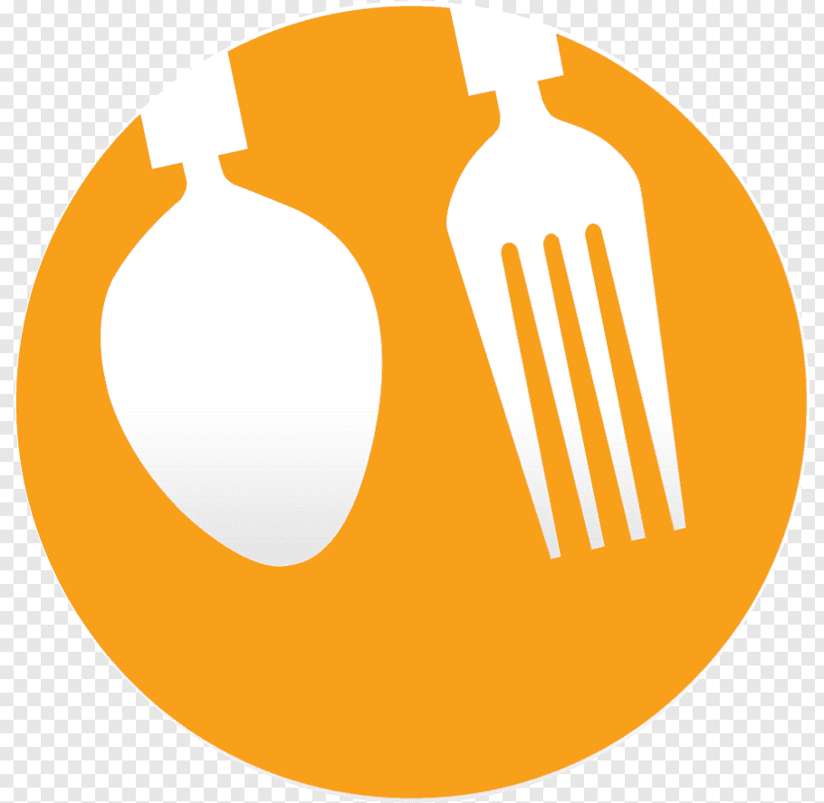<a href=""  style="color: grey;"><b>View Menu</b></a> 

      

      

  

  

    
    

        <h4 class="card-title"><u>Silver Saloon</u></h4>
        
 Rating: 3.8 
 Usha Kiran Palace, Jayendraganj, Gwalior, Madhya Pradesh. 
 <a href=""  style="color: grey;"><b>View Menu</b></a>

      

      

  

  

    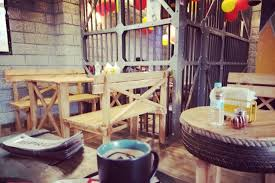
    

        <h4 class="card-title"><u>Cafe Prizon</u></h4>
        
 Rating: 3.8  
 F - 126, Vijay Nagar, Chetakpuri, Lashkar, Gwalior, Madhya Pradesh. 
<a href=""  style="color: grey;"><b>View Menu</b></a> 

      

      

  

  

    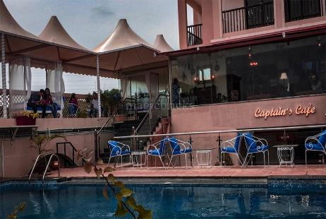
    

        <h4 class="card-title"><u>Captain Cafe</u></h4>
        
 Rating: 4.1 
 2nd Floor, Garden Palace, New Collectorate Rd, above GST BHAWAN, Gwalior, Madhya Pradesh. 
<a href=""  style="color: grey;"> <b>View Menu</b></a>

      

      

  

 

      

         

    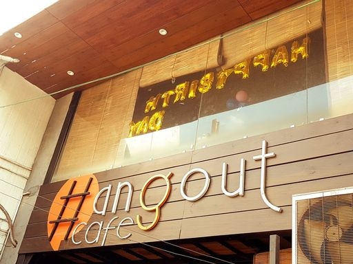
    

        <h4 class="card-title"><u>Hangout Cafe</u></h4>
        
 Rating: 4.0  
City Center, Raksha Vihar, Lashkar, Gwalior, Madhya Pradesh. 
<a href=""  style="color: grey;"> <b>View Menu</b></a>

      

      

  

  

    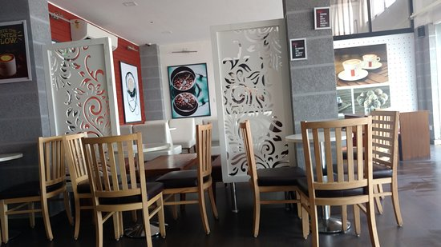
    

        <h4 class="card-title"><u>Barista</u></h4>
        
 Rating: 4.1 
Ground Floor Neo Meridian Shopping Gallery Road, Gulmohar City, Gwalior, Madhya Pradesh. 
<a href=""  style="color: grey;"> <b>View Menu</b></a>

      

      

    

    

    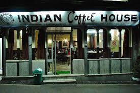
    

        <h4 class="card-title"><u>Indian Coffee House</u></h4>
        
 Rating: 4.1 
Nera Hotel India, Station Rd, LNUPE Campus, Lashkar, Gwalior, Madhya Pradesh. 
<a href=""  style="color: grey;"> <b>View Menu</b></a>

      

      

  

  

    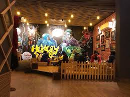
    

        <h4 class="card-title"><u>Hungry Brids Cafe</u></h4>
        
 Rating: 4.0 
1st Floor 647 Roshni Ghar Road, Near, Old High Court, Lashkar, Gwalior, Madhya Pradesh. 
<a href="" style="color: grey;"> <b>View Menu</b></a>

      

      

  

      

      

        

    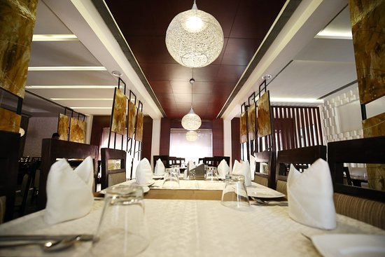
    

        <h4 class="card-title"><u>Moti Mahal Deluxe</u></h4>
        
 Rating: 3.9 
1st Hotel Regency Square Bus Stand Road, near Bus Stand, New Balwant Nagar, Gwalior, Madhya Pradesh.  
 <b>View Menu</b>

      

      

  

    

    
    

        <h4 class="card-title"><u>Virasat The Heritage</u></h4>
        
 Rating: 3.7 
 Main Rd, Jayendraganj, Lashkar, Gwalior, Madhya Pradesh. 
 <b>View Menu</b>

      

      

  

  

    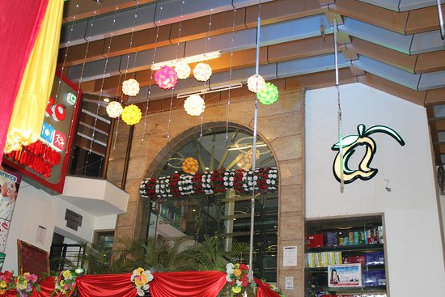
    

        <h4 class="card-title"><u>Alfanzo</u></h4>
        
 Rating: 4.0 
Madhav Rao Scindia Marg, City Center, Raksha Vihar, Lashkar, Gwalior, Madhya Pradesh. 
 <b>View Menu</b>

      

      

    

  

  

    
    

        <h4 class="card-title"><u>Momo Adda</u></h4>
        
 Rating: 3.8
 Maharani Laxmibai Marg, opp. Manas Bhavan, Maharani Laxmi Bai Colony, Lashkar, Gwalior, Madhya Pradesh. 
 <b>View Menu</b>

      

      

  

<h1 style="text-align: center;"><b><u>Top Resturants in Gwalior</u></b></h1>
   
 
 

  

    

      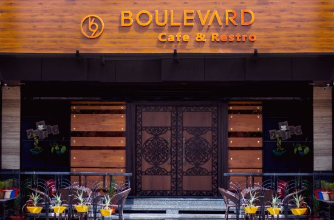
    

    

     

        <h4 class="card-title"><u>Boulevard 69 Cafe & Restro</u></h4>
        
 Rating: 3.9 
G-5, The Empire, City Center, Tulsi Vihar Colony, Gwalior, Madhya Pradesh 474011. 
 11 am to 11 pm 
 <b>View Menu</b>

      

      

    
     
    

  

  

    

      
    

    

     

        <h4 class="card-title"><u>The Mansingh</u></h4>
        
 Rating: 4.1 
3rd Floor Deen Dayal Mall, Maharani Laxmibai Marg, Gwalior, Madhya Pradesh. 
 11 am to 11 pm 
 <b>View Menu</b>

      

      

    

  

  

    

      
    

    

     

        <h4 class="card-title"><u>Victorian Vantage</u></h4>
        
 Rating: 4.0 
 Sanatan Dharam Mandir Rd, Near Chammber of Commerce, Lalitpur Colony, Lashkar, Gwalior, Madhya Pradesh. 
 11 am to 11 pm 
 <b>View Menu</b>

      

      

    
     
    

  

  

    

      
    

    

     

        <h4 class="card-title"><u>Bamboo Square Restaurant</u></h4>
        
 Rating: 4.3 
  Baijnath Apartment, Bamboo square, Basement floor, Govindpuri, Gwalior, Madhya Pradesh. 
 11 am to 11 pm 
 <b>View Menu</b>

      

      

    
     
    

  

    

  

  

   <h2 style="color: #000"><b class="s">"Explore"Gwalior Resturants
    </h2>
    

     
<iframe  width="100%" height="500" frameborder="0" style="border:0;"src="https://www.google.com/maps/embed?pb=!1m16!1m12!1m3!1d28637.394087896857!2d78.1994944919547!3d26.207272579837017!2m3!1f0!2f0!3f0!3m2!1i1024!2i768!4f13.1!2m1!1sRESTURANTS%20in%20gwalior!5e0!3m2!1sen!2sin!4v1587318603532!5m2!1sen!2sin" allowfullscreen=""></iframe>

<footer class="page-footer font-small cyan darken-3" style="background-color: #21d192">

  <!-- Footer Elements -->

    <!-- Grid row-->
    

      <!-- Grid column -->
      

         

          <!-- Facebook -->
          <a class="fb-ic">
            <i class="fa fa-facebook-f fa-lg white-text mr-md-5 mr-3 fa-2x"> </i>
          </a>
          <!-- Twitter -->
          <a class="tw-ic">
            <i class="fa fa-twitter fa-lg white-text mr-md-5 mr-3 fa-2x"> </i>
          </a>
          <!--Instagram-->
          <a class="ins-ic">
            <i class="fa fa-instagram fa-lg white-text mr-md-5 mr-3 fa-2x"> </i>
          </a>
          <!--Pinterest-->
          <a class="pin-ic">
            <i class="fa fa-whatsapp fa-lg white-text fa-2x"> </i>
          </a>
        

      

      <!-- Grid column -->

    

    <!-- Grid row-->
  <!-- Footer Elements -->

  <!-- Copyright -->
  

    <a style="color: white;">© Tourism @ 2020 :</a>
    <a href="GwlTourism.html">GwlTourism.com</a>
  

  <!-- Copyright -->

</footer>
<!-- Footer -->

</body>
</html>
